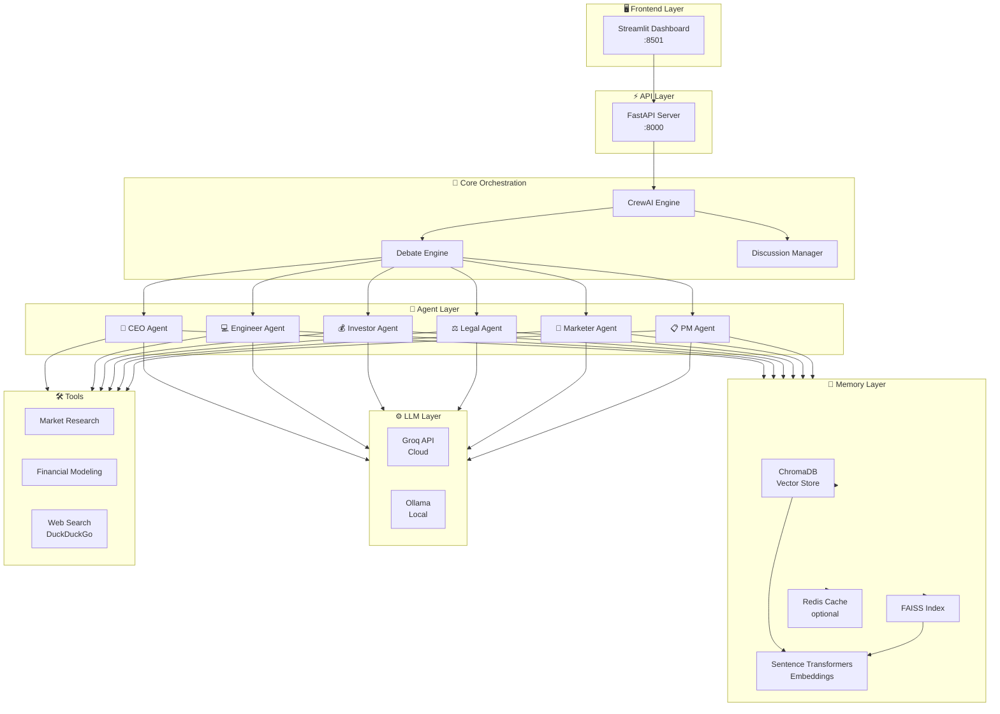

<div align="center">

<!-- BANNER -->


<!-- BADGES -->
[](https://python.org)
[](https://crewai.com)
[](https://fastapi.tiangolo.com)
[](https://streamlit.io)
[](https://groq.com)
[](https://ollama.ai)
[](LICENSE)
[](https://docs.microsoft.com/powershell)

<br/>

> **A sophisticated AI simulation platform** where six specialized agents — CEO, Engineer, Investor, Legal, Marketer, and Product Manager — collaborate to simulate a real startup ecosystem in real time.

<br/>

[🚀 Quick Start](#-quick-start) • [🏗️ Architecture](#️-architecture) • [🤖 Agents](#-agents) • [⚙️ Configuration](#️-configuration) • [📡 API](#-api-reference) • [🐳 Docker](#-docker)

</div>

---

## 📋 Table of Contents

- [✨ Features](#-features)
- [🏗️ Architecture](#️-architecture)
- [🤖 Agents](#-agents)
- [🚀 Quick Start](#-quick-start)
- [⚙️ Configuration](#️-configuration)
- [📡 API Reference](#-api-reference)
- [🖥️ Dashboard](#️-dashboard)
- [🐳 Docker](#-docker)
- [🧪 Testing](#-testing)
- [📦 Tech Stack](#-tech-stack)
- [🗺️ Roadmap](#️-roadmap)
- [🤝 Contributing](#-contributing)

---

## ✨ Features

<table>
<tr>
<td width="50%">

### 🤖 Multi-Agent Collaboration
Six specialized AI agents simulate distinct startup roles, each with domain knowledge and autonomous decision-making powered by CrewAI.

### 🧠 Persistent Memory
Vector-based memory using ChromaDB + FAISS, with optional Redis persistence across sessions.

### ⚡ Dual LLM Support
Use **Groq** (cloud, blazing fast) or **Ollama** (fully local, private) — switch with a single env variable.

</td>
<td width="50%">

### 📊 Real-Time Dashboard
Streamlit-powered UI with live simulation monitoring, agent logs, and decision visualization.

### 🔌 REST API
FastAPI server with async endpoints for external integrations, webhooks, and automation.

### 🛠️ Built-in Tools
Market research, competitor analysis, financial modeling, and DuckDuckGo-powered web search.

</td>
</tr>
</table>

---

## 🏗️ Architecture



---

## 🤖 Agents

Each agent is an autonomous AI entity with a specialized role, goals, and tools.

<details>
<summary><b>👔 CEO Agent — Strategic Leadership</b></summary>

- Sets company vision and strategic direction
- Makes high-level product and business decisions
- Balances input from all other agents
- Arbitrates conflicts during debates

</details>

<details>
<summary><b>💻 Engineer Agent — Technical Execution</b></summary>

- Evaluates technical feasibility of ideas
- Estimates development timelines and complexity
- Proposes system architectures
- Flags technical risks and blockers

</details>

<details>
<summary><b>💰 Investor Agent — Financial Strategy</b></summary>

- Analyzes startup economics and burn rate
- Models funding scenarios and valuations
- Evaluates ROI for product decisions
- Simulates investor Q&A and due diligence

</details>

<details>
<summary><b>⚖️ Legal Agent — Risk & Compliance</b></summary>

- Identifies legal risks in business decisions
- Reviews contracts and IP considerations
- Flags regulatory and compliance concerns
- Advises on corporate structure

</details>

<details>
<summary><b>📣 Marketer Agent — Growth & GTM</b></summary>

- Develops go-to-market strategies
- Conducts competitor and market analysis
- Plans campaigns and positioning
- Drives customer acquisition frameworks

</details>

<details>
<summary><b>📋 Product Manager Agent — Product Strategy</b></summary>

- Defines product roadmap and priorities
- Translates user needs into requirements
- Manages feature trade-offs and backlog
- Coordinates between engineering and business

</details>

---

## 🚀 Quick Start

### Prerequisites

| Requirement | Version | Notes |
|---|---|---|
| Python | 3.8+ | [python.org](https://python.org) |
| PowerShell | 5.1+ | Windows only |
| Groq API Key | — | [console.groq.com](https://console.groq.com) |
| Redis *(optional)* | 7+ | For persistent memory |
| Ollama *(optional)* | latest | For local LLM |

### 1️⃣ Clone the Repository

```bash
git clone https://github.com/your-username/multi-agent-startup-simulator.git
cd multi-agent-startup-simulator
```

### 2️⃣ Configure Environment

```bash
# Copy the example env file
cp .env.example .env

# Edit .env with your keys
notepad .env      # Windows
nano .env         # Linux/macOS
```

> **Minimum required:**
> ```env
> GROQ_API_KEY=your_groq_api_key_here
> ```

### 3️⃣ Run Setup (Windows)

```powershell
# Creates virtual environment, installs dependencies, creates data dirs
.\setup.ps1
```

<details>
<summary>🐧 Linux / macOS Setup</summary>

```bash
python -m venv .venv
source .venv/bin/activate
pip install -r requirements.txt
mkdir -p data/conversations data/embeddings data/logs data/startups
```

</details>

### 4️⃣ Start the Application

```powershell
# Windows (recommended)
.\START.ps1

# Or directly
python run.py
```

### 5️⃣ Open the Interfaces

| Interface | URL | Description |
|---|---|---|
| 🖥️ Dashboard | http://localhost:8501 | Streamlit real-time UI |
| ⚡ API | http://localhost:8000 | FastAPI REST server |
| 📖 API Docs | http://localhost:8000/docs | Swagger / OpenAPI |

---

## ⚙️ Configuration

All settings are managed via `.env`. Here is the full reference:

<details>
<summary><b>🔑 LLM Configuration</b></summary>

```env
# Groq (Cloud — fast, recommended)
GROQ_API_KEY=your_groq_api_key_here

# Ollama (Local — private, no API key needed)
OLLAMA_BASE_URL=http://localhost:11434

# Model parameters
MAX_TOKENS=4096
TEMPERATURE=0.7

# Note: OpenAI is not used in this project
```

</details>

<details>
<summary><b>🧠 Memory Configuration</b></summary>

```env
# Enable Redis for persistent cross-session memory
USE_REDIS=false
REDIS_URL=redis://localhost:6379

# Vector store settings
VECTOR_DIMENSION=384
CHUNK_SIZE=1000
CHUNK_OVERLAP=200
```

</details>

<details>
<summary><b>🌐 Server Configuration</b></summary>

```env
# API Server
API_HOST=0.0.0.0
API_PORT=8000

# Streamlit Dashboard
UI_PORT=8501
RUN_UI=true
```

</details>

<details>
<summary><b>🤖 Simulation Configuration</b></summary>

```env
# Run automatic simulation cycles
RUN_SIMULATION=true
SIMULATION_INTERVAL=30    # seconds between cycles

# CrewAI settings
MAX_ITERATIONS=10
VERBOSE=true

# Debug
DEBUG=false
LOG_LEVEL=INFO
```

</details>

---

## 📡 API Reference

The FastAPI server exposes a REST API for external integrations.

<details>
<summary><b>📌 Endpoints Overview</b></summary>

| Method | Endpoint | Description |
|---|---|---|
| `GET` | `/` | Health check |
| `GET` | `/agents` | List all active agents |
| `POST` | `/simulate` | Start a simulation run |
| `GET` | `/simulation/{id}` | Get simulation status |
| `GET` | `/conversations` | List all conversations |
| `POST` | `/debate` | Trigger an agent debate |
| `GET` | `/memory` | Query the vector memory |

> Full interactive docs at **http://localhost:8000/docs**

</details>

<details>
<summary><b>💡 Example — Start a Simulation</b></summary>

```bash
curl -X POST http://localhost:8000/simulate \
  -H "Content-Type: application/json" \
  -d '{
    "scenario": "Launch a SaaS product for remote teams",
    "agents": ["CEO", "Engineer", "Investor", "Marketer"],
    "rounds": 5
  }'
```

</details>

---

## 🖥️ Dashboard

The Streamlit dashboard provides:

- **Live Agent Feed** — real-time log of each agent's decisions and responses
- **Debate Viewer** — structured view of multi-agent discussions
- **Memory Explorer** — browse the vector memory store
- **Financial Charts** — Plotly-based financial projections (Investor agent output)
- **Simulation Controls** — start, pause, and configure runs from the UI

Access at: **http://localhost:8501**

---

## 🐳 Docker

Run the entire stack with Docker Compose (no manual setup needed):

```bash
# Build and start all services
docker-compose up --build

# Run in background
docker-compose up -d

# Stop services
docker-compose down
```

> Services started: App server, Streamlit UI, Redis, ChromaDB

---

## 🧪 Testing

```bash
# Activate virtual environment first
.venv\Scripts\Activate.ps1   # Windows
source .venv/bin/activate     # Linux/macOS

# Run full test suite
python -m pytest tests/ -v

# Run specific test module
python -m pytest tests/test_agents.py -v

# Run with coverage report
python -m pytest tests/ --cov=app --cov-report=html
```

---

## 📦 Tech Stack

| Category | Technology |
|---|---|
| **Agent Framework** | CrewAI |
| **LLM (Cloud)** | Groq |
| **LLM (Local)** | Ollama |
| **LLM Orchestration** | LangChain, LangChain-Community |
| **Vector Store** | ChromaDB, FAISS |
| **Embeddings** | Sentence Transformers |
| **Caching** | Redis |
| **API Server** | FastAPI + Uvicorn |
| **Dashboard** | Streamlit |
| **Data & Charts** | Pandas, NumPy, Plotly |
| **Web Search** | DuckDuckGo Search |
| **ML** | PyTorch, Transformers, scikit-learn |
| **Config** | python-dotenv, PyYAML |
| **Logging** | Loguru, Rich |
| **Token Counting** | tiktoken |

---

## 🗺️ Roadmap

- [x] Six-agent simulation framework
- [x] CrewAI task orchestration
- [x] Groq & Ollama LLM support
- [x] Vector memory system
- [x] Streamlit dashboard
- [x] FastAPI REST server
- [ ] WebSocket real-time streaming
- [ ] Scenario templates library
- [ ] Agent personality configuration UI
- [ ] Export simulation reports (PDF)
- [ ] Multi-startup comparison mode

---

## 🤝 Contributing

Contributions are welcome! Here's how to get started:

```bash
# Fork → Clone → Branch
git checkout -b feature/your-feature-name

# Make changes, then commit
git commit -m "feat: add your feature"

# Push and open a Pull Request
git push origin feature/your-feature-name
```

Please follow [conventional commits](https://www.conventionalcommits.org) and ensure tests pass before submitting a PR.

---

## 📄 License

This project is licensed under the **MIT License** — see the [LICENSE](LICENSE) file for details.

---

<div align="center">


**Built with ❤️ using CrewAI, Groq, and Python**

⭐ Star this repo if you find it useful!

</div>
